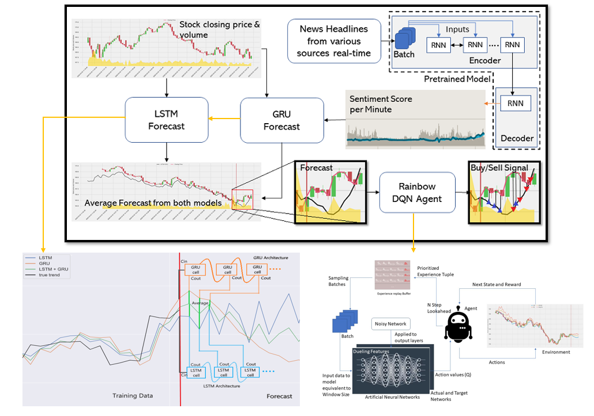

# Real Time Stock Market Forecasting

This repository contains an implementation of ensemble deep learning models to forecast or predict stock price. We used Alpha Vantage API to pull stock data(open,high,low,close,volume) and scraped news headlines from inshorts to perform sentiment analysis.

It is at intermediate phase, we have to implement sentiment analysis and forecasting of all types of companies. 

## Architecture

