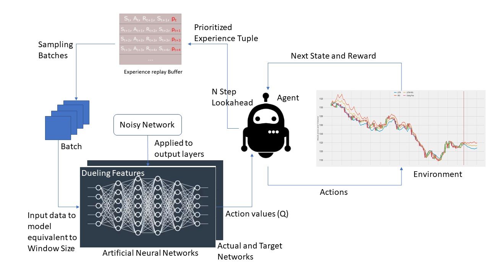

# Rainbow DQN Agent

This section of the repository contains an implementation of Rainbow DQN Agent for predicting buy/sell signals on a stock trend. 

## Architecture



We were able to implement all the descendants of Rainbow DQN except Categorical DQN

- [x] Vanilla DQN
- [x] DQN with fixed target distribution
- [x] Double DQN
- [x] Prioritized Experience Replay
- [x] Dueling Network Architectures
- [x] Noisy Nets
- [x] Multi Step Reinforcement Learning
- [ ] Categorical DQN

## Data

Used Historical Financial data from [Yahoo! Finance](https://ca.finance.yahoo.com/) for training, or even use some sample datasets already present under `data/`.

## Running

You can open up a terminal and start training the agent:

```bash
python train.py data/GOOG.csv data/GOOG_2018.csv --strategy double-dqn
```

Once you're done training, run the evaluation script and let the agent make trading decisions:

```bash
python eval.py data/GOOG_2019.csv --model-name model_noisynstepperdddqn_20 --debug
```